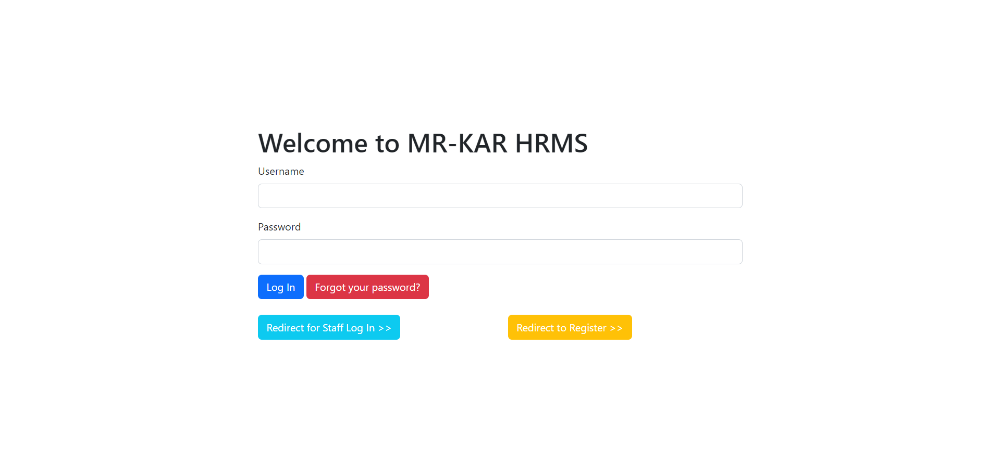

# Introduction to MR-KAR HRMS

This is a simple job application web app. There are 3 types of user:
- Superuser
- Staff (HR)
- Candidate

# Built-in User Credentials

While starting the app, 3 users be created. 
- Superuser
  - username: `admin`
  - password: `123`
- Staff (HR)
  - username: `staff@mr-kar.com`
  - password: `123`
- Candidate
  - username: `candidate@mr-kar.com`
  - password: `123`

## Superuser & Staff Users

These users can create Job Posts, Job Skills (to bind with job posts and to make choosable for candidates), and see candidate profiles and do other admin-related stuff. **Default Django Admin app customized for these users.**

### Important for Staff Users

They have to be approved by superusers when they register to the app by using `/register` link to access the admin app and log in to the app. When a new user registered to the app, the system automatically checks the user if he is staff or not. If he is staff, the system adds the permissions to the user's permission set to handle CRUD operations. However, to prevent any disallowed process, the staff user has to be approved by a superuser (make this account active; `is_active` field)

## Candidates

These users can login & register for the app. They can edit their profiles and search for open positions. Also, they can apply for the open positions.

### Important for Candidates

When a new user registered to the app, the system automatically checks the user if he is staff or not. If he isn't staff, automatically a candidate profile creates (by using Django signals). They don't need to be approved by staff to log in to the system. They can edit their candidate profiles from their profile pages.

# To Prepare for Production Ready

Implementing a real mail backend (`settings.py`, for password reset mails) for production will be enough to deploy this app.

